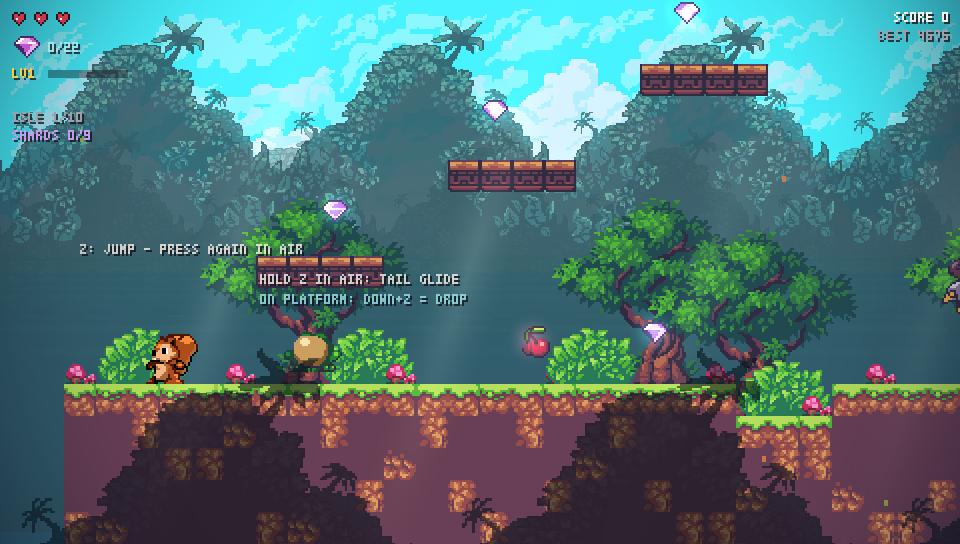

# Skyrift

PS Vita ve masaüstü için özgün, serbest uçuşlu pixel-art macera oyunu.

- **Kod**: özgün, tek dosya C99 + SDL2 ([src/main.c](src/main.c))
- **Sanat**: ["Sunny Land"](https://opengameart.org/content/sunny-land-2d-pixel-art-pack) — Ansimuz, **CC0** (`assets/`)
- **Ses**: dosyasız — açılışta sentezlenen yumuşak chiptune efektler + ambiyans müzik döngüsü (I-vi-IV-V arpej)
- **PNG yükleyici**: [stb_image](https://github.com/nothings/stb) — public domain



## Hikaye

Sunreef Adaları, Kadim Rüzgar'ın üzerinde süzülür. Gök Tiranı (Sky Tyrant)
Büyük Fener'i paramparça etti; dokuz kırığı adalara saçıldı. Rüzgar ölüyor,
adalar batıyor. Sen **Kip** — son Planörcü Kurye, kabarık kuyruğuyla rüzgarı
yakalayan bir uçan sincapsın. On adayı aş, her kırığı kurtar, Fener'i yak.

## Yapı: 10 Ada

| # | Ada | Tarz | Boss |
|---|-----|------|------|
| 1 | Verdant Woods | açık orman, öğretici | — |
| 2 | Twilight Hollow | mağara galerileri | — |
| 3 | Canopy Heights | dev ağaçlar, dikey | **MIRE KING** (dev kurbağa) |
| 4 | Sunken Grotto | dolambaçlı tüneller | — |
| 5 | Windy Cliffs | yükselen teraslar | **RUST FANG** (dev keseli sıçan) |
| 6 | Ruined Hamlet | çukurlu ova, çatılar | — |
| 7 | The Underroot | yeraltı labirenti | **GALE WRAITH** (mor kartal) |
| 8 | Skybridge | boşluk üstü köprüler | — |
| 9 | Storm Ascent | dikey zigzag tırmanış | — |
| 10 | Tyrant's Throne | gökyüzü arenası | **SKY TYRANT** (final) |

Her adanın çıkış kapısı yeterli mücevher toplanınca (ve varsa boss ölünce)
açılır. Kapıdan geçmek = bir Fener kırığı. 10. adada Tiranı devir, Fener'i yak.

## Kontroller

| Eylem  | Masaüstü            | PS Vita          |
|--------|---------------------|------------------|
| Hareket| Ok tuşları / WASD   | Sol analog / dpad|
| Zıpla / Çift zıpla | Z / Space | Cross (X)      |
| Süzül (havada basılı tut) | Z | Cross (X)        |
| Ateş   | X / Shift           | Square (kare)    |
| Dash (LV2+) | C / V          | Circle (yuvarlak)|
| Duraklat | P                 | Start            |
| Çıkış  | ESC                 | Select           |

## Mekanikler

- Havada tekrar bas → **çift zıplama** (topaklanıp takla atar); havada **basılı tut → kuyrukla süzülme** (yavaş alçalır, güçlü yatay kontrol) — planörcü sincap!
- Tuğla platformlar tek yönlü; üstündeyken aşağı+zıpla → içinden düş
- **Skor & combo**: mücevher +100, düşman +40/50, boss +1000; zincir öldürmede çarpan
- **Seviye yetenekleri**: LV2 dash · LV3 çift atış · LV4 hızlı ateş · LV5 +1 can · LV6 üçlü atış
- **Düşmanlar**: kartal (kovalar), kurbağa (pusu atlar), keseli sıçan (devriye) + 4 boss
- Kirazlar can doldurur; checkpoint tabelaları yeniden doğma noktası
- Rekor skor cihaza kaydedilir; bitişte süre gösterilir
- Coyote time, değişken zıplama, squash & stretch, mücevher mıknatısı, boss telegraf

## Masaüstü derleme

```sh
brew install sdl2 cmake   # bir kere
mkdir -p build && cd build
cmake .. -DCMAKE_BUILD_TYPE=Release
make
./skyrift
```

## PS Vita derleme (.vpk)

### 1. VitaSDK kurulumu (macOS, bir kere)

```sh
git clone https://github.com/vitasdk/vdpm
cd vdpm
./bootstrap-vitasdk.sh
export VITASDK=/usr/local/vitasdk        # ~/.zshrc'ye de ekle
export PATH=$VITASDK/bin:$PATH
./install-all.sh                          # SDL2 dahil tüm portları kurar
```

### 2. VPK üretimi

```sh
mkdir -p build-vita && cd build-vita
cmake .. -DBUILD_VITA=ON -DCMAKE_BUILD_TYPE=Release
make skyrift.vpk
```

### 3. Vita'ya yükleme

Vita'nın jailbreak'li olması gerekir (h-encore² + HENkaku, [vita.hacks.guide](https://vita.hacks.guide)).
`skyrift.vpk`'yı VitaShell FTP ile at, X → Install, LiveArea'dan başlat.

## Geliştirici notları

- Haritalar [genlevels.py](tools/genlevels.py) ile üretilir → `src/levels.h`
  (yerleşim doğrulamalı: hiçbir öğe zemine gömülemez / boşlukta süzülemez)
- `SKYRIFT_TEST=1 ./skyrift` — fizik & yetenek smoke testleri
- `SKYRIFT_SHOT=/path.bmp ./skyrift` — bir kare yakalayıp çıkar
- `SKYRIFT_LEVEL=n ./skyrift` — n. adadan başla (0-9)
- `SKYRIFT_TITLE=1` — shot modunda başlık ekranını çek

## Lisans

Kod MIT. Sanat varlıkları Ansimuz'un CC0 "Sunny Land" paketinden.
stb_image public domain.
